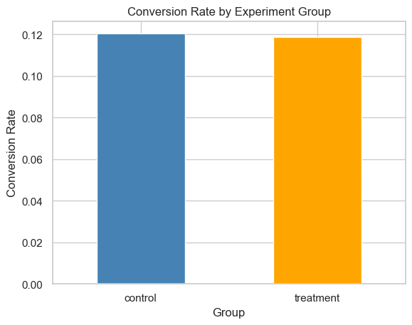
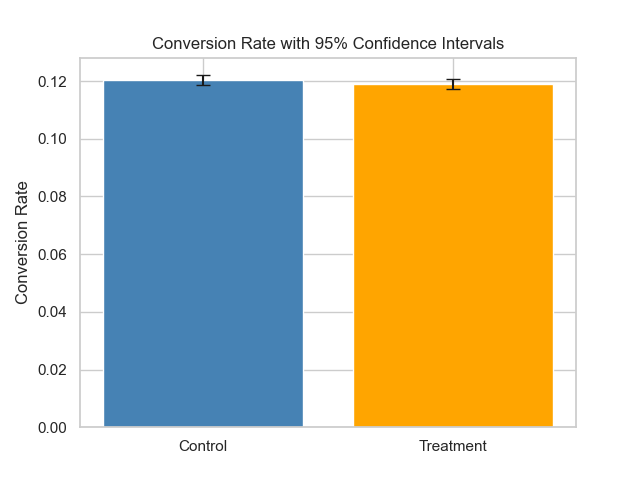

# 📊 Product A/B Testing Analysis

Analysis of an online **A/B testing experiment** to evaluate whether a new landing page improves conversion rates.
The project applies **conversion rate analysis, statistical hypothesis testing, uplift calculation, and confidence intervals** to guide product decision-making.

---

# 🔍 Experiment Overview

| Metric                    | Value               |
| ------------------------- | ------------------- |
| Total Users               | **294,478**         |
| Control Conversion Rate   | **12.04%**          |
| Treatment Conversion Rate | **11.89%**          |
| Uplift                    | **-0.148%**         |
| P-value                   | **0.216**           |
| Statistical Result        | **Not Significant** |

---

# 📈 Experiment Visualization

### Conversion Rate Comparison

### Conversion Rate with 95% Confidence Intervals

---

# 🧠 Key Insight

The new landing page does **not significantly improve conversion rate** compared to the existing design.

Although the control group performs slightly better, statistical testing indicates the difference is **not significant**, suggesting the observed variation is likely due to random chance.

---

# 💡 Business Recommendation

• Retain the current landing page design
• Run additional experiments with more impactful UI/UX changes
• Focus on elements like **CTA placement, page layout, and personalization**

---
